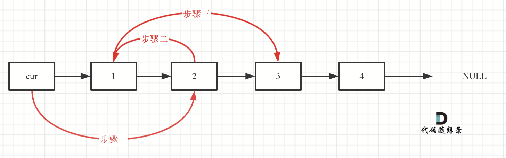
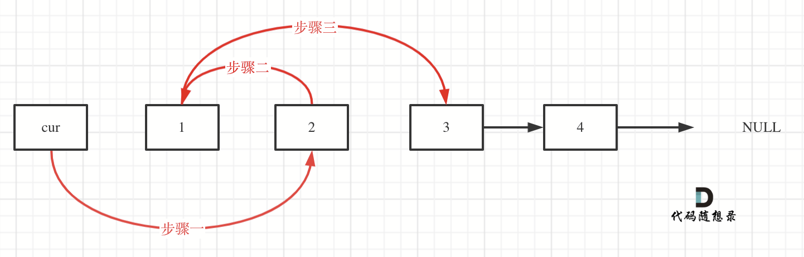
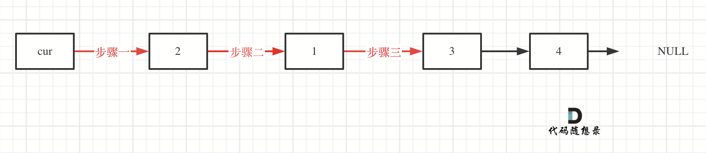

# Day 4 Linked list

### 24. Swap nodes in pairs $\color{orange}{\textsf{MEDIUM}}$

> Given a linked list, swap every two adjacent nodes and return its head. You must solve the problem without 
> modifying the values in the list's nodes (i.e., only nodes themselves may be changed.)

> example 1:


```
# Definition for singly-linked list.
# class ListNode(object):
#     def __init__(self, val=0, next=None):
#         self.val = val
#         self.next = next
class Solution(object):
    def swapPairs(self, head):
        """
        :type head: ListNode
        :rtype: ListNode
        """
        dummy_head = ListNode(next=head)
        current = dummy_head
        
        while (current.next and current.next.next):
            temp1 = current.next
            temp2 = current.next.next.next

            current.next = current.next.next
            current.next.next = temp1
            current.next.next.next = temp2

            current = current.next.next
        return dummy_head.next

```

Note:
the swap only occurs in a pair; if there is odd number of nodes, no swapping for the last node

Approach: dummy head + swap (3 pointers). This swap operation can be viewed as rearrange the 3 nodes, then 
straighten the tangled list order. 

Key points:
1. dummy head is needed as the current node
2. two backup nodes are needed because swap operates on pair, the next iteration occurs at 2 nodes later than current
   - backup 1 -> node 2 in pair (now it's a 3-node pair)
   - backup 2 -> node 4, which is the next of the 3-node pair
3. swapping sequence
    - current being dummy head (node 1)
    - assign node 3 to be node 1's next
    - assign node 2 to be node 3's next (recall node 1 and node 2 are disconnected due to the assigning above, now 
      backup 1 is used) 
    - assign node 4 to be node 1's next (similarly, node 4 and node 3 are disconnected too, now backup 2 is used)
4. update current to be node 4






### 19. Remove Nth Node from End of List $\color{green}{\textsf{EASY}}$
>Given the head of a linked list, remove the nth node from the end of the list and return its head.

>Example 1: 
>Input: head = [1,2,3,4,5], n = 2 Output: [1,2,3,5]

```
class Solution:
    def removeNthFromEnd(self, head: Optional[ListNode], n: int) -> Optional[ListNode]:
        dummy_head = ListNode(next=head)
        slow, fast = dummy_head, dummy_head
        for i in range(n+1):
            fast = fast.next

        while fast:
            fast = fast.next
            slow = slow.next

        slow.next = slow.next.next

        return dummy_head.next

```

Approach: dummy head + two pointers

Key points:
1. two pointers: slow-fast pointers starting from dummy head
2. to remove the nth node from end of list, let fast pointer move n+1 steps, and then sync slow and fast pointers to 
   move along until fast reaches the end of the list
3. assign slow.next to slow.next.next


### 160. Intersection of two linked lists $\color{green}{\textsf{EASY}}$
>Given the heads of two singly linked-lists headA and headB, return the node at which the two lists intersect. If 
> the two linked lists have no intersection at all, return null.

>Example 1:
> Input: intersectVal = 8, listA = [4,1,8,4,5], listB = [5,6,1,8,4,5], skipA = 2, skipB = 3 Output: Intersected at '8' 
> Explanation: The intersected node's value is 8 (note that this must not be 0 if the two lists intersect). From the 
> head of A, it reads as [4,1,8,4,5]. From the head of B, it reads as [5,6,1,8,4,5]. There are 2 nodes before the 
> intersected node in A; There are 3 nodes before the intersected node in B. - Note that the intersected node's 
> value is not 1 because the nodes with value 1 in A and B (2nd node in A and 3rd node in B) are different node 
> references. In other words, they point to two different locations in memory, while the nodes with value 8 in A and 
> B (3rd node in A and 4th node in B) point to the same location in memory.

Approach 1: right-align the two lists + one pointer per list
```
class Solution:
    def getIntersectionNode(self, headA: ListNode, headB: ListNode) -> Optional[ListNode]:

        lenA = 0
        i = headA
        while i:
            i = i.next
            lenA += 1

        lenB = 0
        i = headB
        while i:
            i = i.next
            lenB += 1

        curA, curB = headA, headB
        if lenA < lenB:
            lenA, lenB = lenB, lenA
            curA, curB = headB, headA

        len_diff = lenA - lenB

        for _ in range(len_diff):
            curA = curA.next
        while curA and curB:
            if curA == curB:
                return curA
            curA = curA.next
            curB = curB.next

        return None

```
Key points:
1. get lenA and lenB, then use them to right align the two lists, and to ensure top list is longer (or shorter)
2. start from the longer list's ∆-th node and short's first node, exhaust to find two same nodes
3. note that only values being equal doesn't mean nodes are the same (reference being different)

Approach 2: let the two pointers (one per list) go in each list, then go to the other list 
```
class Solution:
    def getIntersectionNode(self, headA: ListNode, headB: ListNode) -> Optional[ListNode]:

        if not headA or not headB:
            return None

        pointerA = headA
        pointerB = headB

        while pointerA != pointerB:
            if pointerA:
                pointerA = pointerA.next
            else:
                pointerA = headB

            # pointerA = pointerA.next if pointerA else headB
            pointerB = pointerB.next if pointerB else headA

        return pointerA
```
This approach is equivalent to exhaust two lists by 
1. exhausting them in the first time to get ∆ (lenA-lenB)
2. use ∆ to set apart two pointers
3. the same exhausting until finding the intersection


Note: this problem assumes right side intersection, and that it has to be a complete intersection, which means list 
A and B's intersection ends at the end if there is an overlap. 
However, this isn't a typical intersection. Broadly, the intersection of two lists could locate anywhere in the two 
lists. Under this circumstance, Approach 2 (exchange list to exhaust) could work much better and intuitively. 


### 142. Linkded list cycle II $\color{orange}{\textsf{MEDIUM}}$
>Given the head of a linked list, return the node where the cycle begins. If there is no cycle, return null.
>There is a cycle in a linked list if there is some node in the list that can be reached again by continuously 
> following the next pointer. Internally, pos is used to denote the index of the node that tail's next pointer is 
> connected to (0-indexed). It is -1 if there is no cycle. Note that pos is not passed as a parameter.
>Do not modify the linked list.
>Example 1:
>Input: head = [3,2,0,-4], pos = 1 Output: tail connects to node index 1 Explanation: There is a cycle in the linked 
> list, where tail connects to the second node.

Approach 1: set + exhaust the list
```
class ListNode:
    def __init__(self, x):
        self.val = x
        self.next = None

class Solution:
    def detectCycle(self, head: [ListNode]) -> [ListNode]:
        container = set()

        cur = head
        while cur:
            if cur in container:
                return cur
            container.add(cur)
            cur = cur.next

        return None
```


Approach 2: math proving


